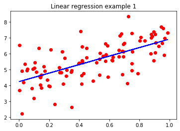
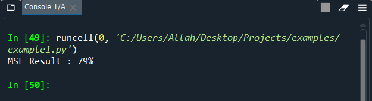
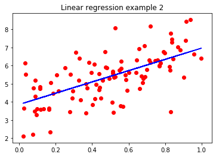
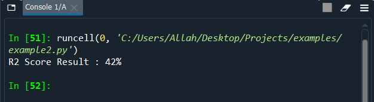

# Example 1
Using **normal equation** to build the model and measure efficiency by using **MSE meter**

# Example 2
Using **gradient descent** to build the model and measure efficiency by using **R2 Score meter**

# Notes
**Example 1 dataset** is different from **Example 2 dataset**
